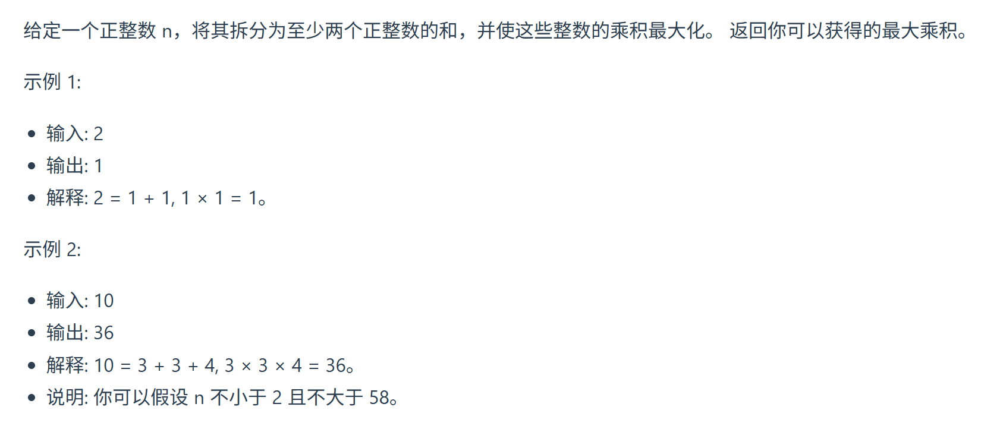

343. 整数拆分 （可跳过）
本题思路并不容易想，一刷建议可以跳过。如果学有余力，可以看视频理解一波。

https://programmercarl.com/0343.%E6%95%B4%E6%95%B0%E6%8B%86%E5%88%86.html   
视频讲解：https://www.bilibili.com/video/BV1Mg411q7YJ


## 思路
### 1.dp含义
dp[i]:i 拆的最大积为dp[i]
### 2.递推
`dp[i]=dp[i-j]*j`
### 3.初始化
dp[0]=0(无意义)  
dp[1]=0（无意义）  
dp[2]=1
### 4.递推公式
```python
for i in range(3,n+1):
    for j in range(1,i):
        dp[i]=max(dp[i], (i - j) * j, dp[i - j] * j)
```