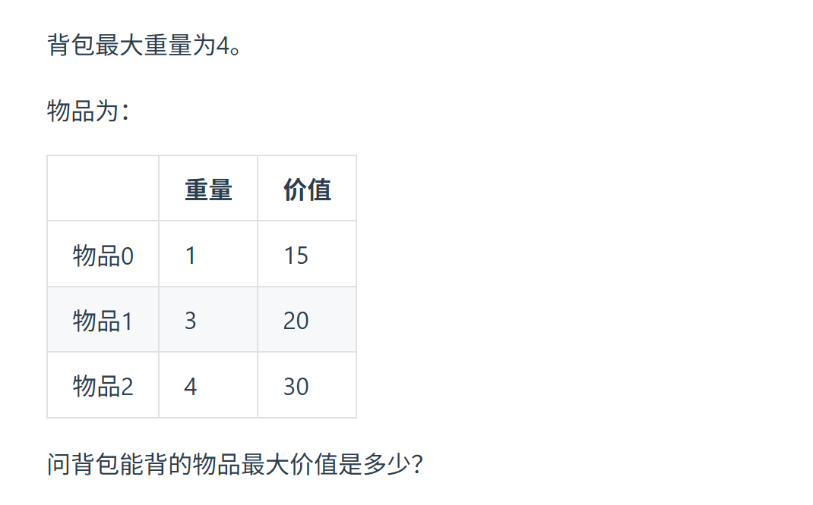
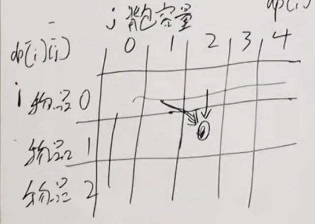
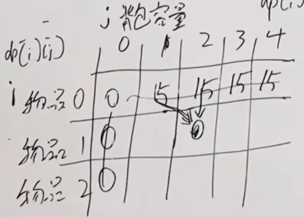
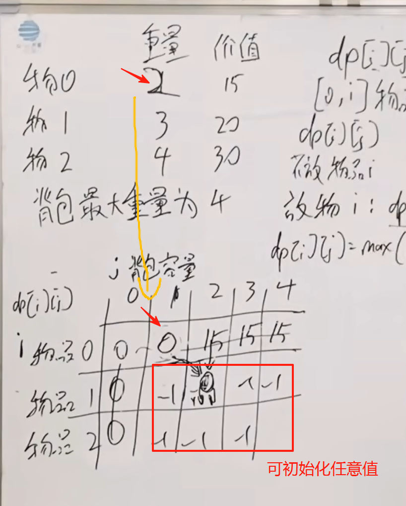

 01背包问题 二维 
https://programmercarl.com/%E8%83%8C%E5%8C%85%E7%90%86%E8%AE%BA%E5%9F%BA%E7%A1%8001%E8%83%8C%E5%8C%85-1.html  
视频讲解：https://www.bilibili.com/video/BV1cg411g7Y6  

 
## 思路
### 1.dp数组的含义  
`dp[i][j]`：下标为[0,i]之间的物品人去放到容量为 j 的背包  

### 2.递推公式  
- 不放物品i，背包的最大价值：`dp[i-1][j]`  
- 放物品i,背包的最大价值 : `dp[i-1][j-weight[i]+value[i]`
```python
dp[i][j]=max(dp[i-1][j],dp[i-1][j-weight[i]+value[i])
```

### 3.初始化  
初始化dp[0][j],dp[i][0] ↓
   
  


### 4.遍历顺序  
对于二维数组实现的01背包问题：  
- 两层for循环可以颠倒  
--> 中间元素是由正上方和左上方元素推到而来，无论哪个顺序遍历都可以正常计算

一维数组就不行了
