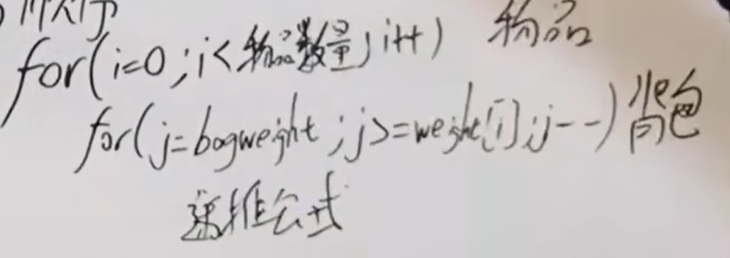
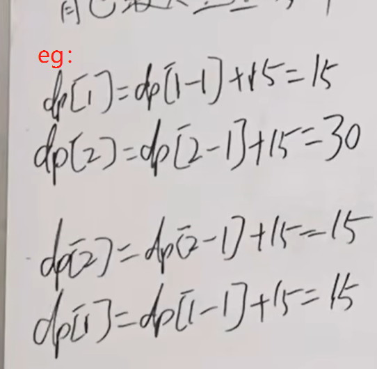

 01背包问题 一维 
https://programmercarl.com/%E8%83%8C%E5%8C%85%E7%90%86%E8%AE%BA%E5%9F%BA%E7%A1%8001%E8%83%8C%E5%8C%85-2.html  
视频讲解：https://www.bilibili.com/video/BV1BU4y177kY  

## 思路
### 1.dp数组的含义
`dp[j]`：容量为j的背包所含物品的最大价值  
    滚动数组↑

### 2.递推公式  
`dp[j]=max(dp[j],dp[j-weight[i]]+value[i])`  

### 3.初始化  
- `dp[0]=0`
- 非0下标，只要初始化成一个非负数里面的最小值就可以了

### 4.遍历顺序  
遍历背包时倒序：保证每个物品只被添加过一次
 

- 二维数组中为什么正序和倒序都可以？
>- 当前层的值不受上一层数值的影响，两层的数据是完全隔离开的
>- 一维数组是重复利用的，如果遍历顺序没有讲究的话，当前数据值和新值很容易产生冲突
