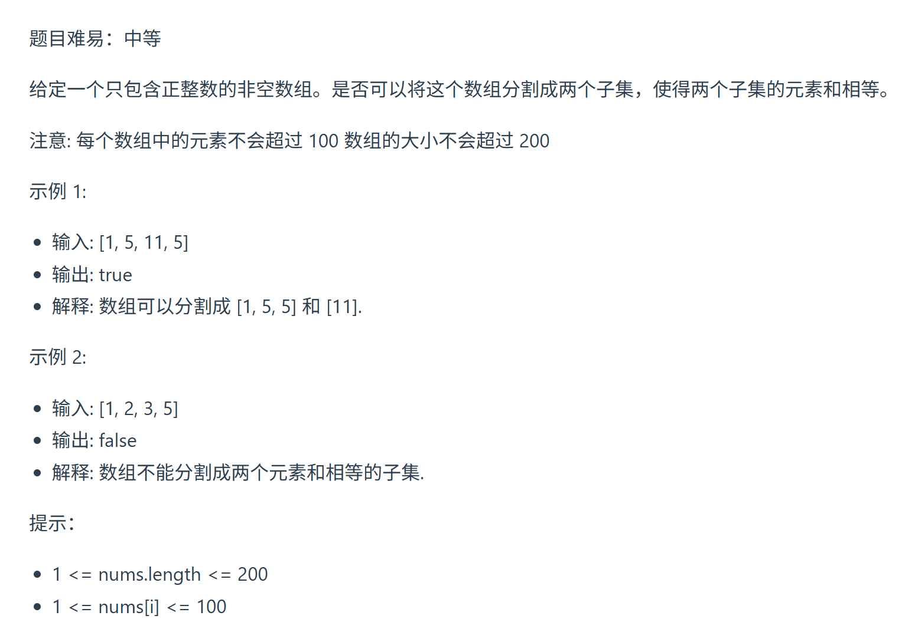

本题是 01背包的应用类题目
https://programmercarl.com/0416.%E5%88%86%E5%89%B2%E7%AD%89%E5%92%8C%E5%AD%90%E9%9B%86.html    
视频讲解：https://www.bilibili.com/video/BV1rt4y1N7jE

## 思路  
### 1.dp数组的含义
每个元素的数值，既是重量也是价值  
dp[j]:   
dp[target]==target:背包就装满了
### 2.递推公式  
`dp[j]=max(dp[j],dp[j-weight[i]]+value[i])`  
=>`dp[j]=max(dp[j],dp[j-nums[i]]+nums[i])`  

### 3.初始化  
dp[0]=0   
非0下标也是0=>`max(dp[j],dp[j-nums[i]]+nums[i])`时不会让初始化的值覆盖掉要更新的值

### 4.遍历顺序  
 

