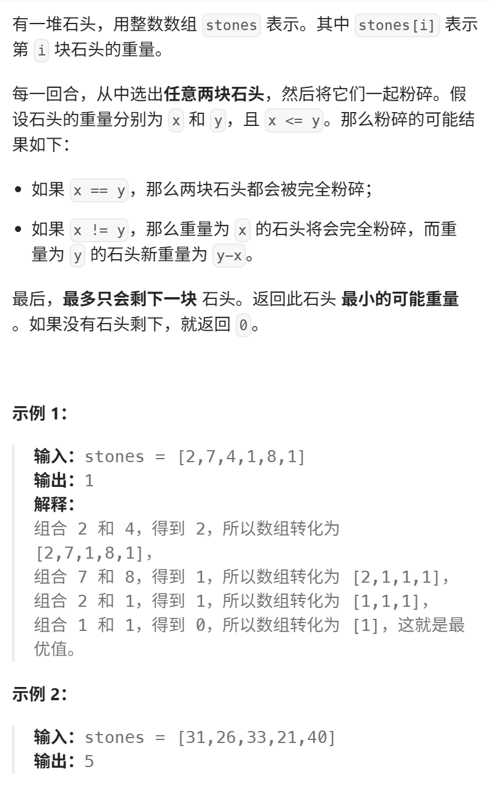
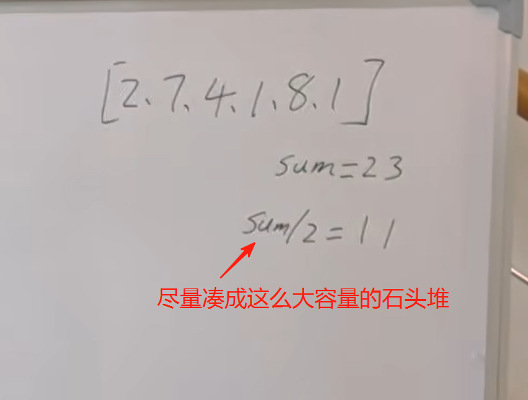
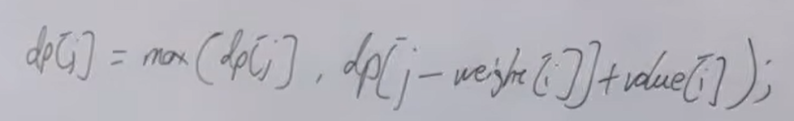
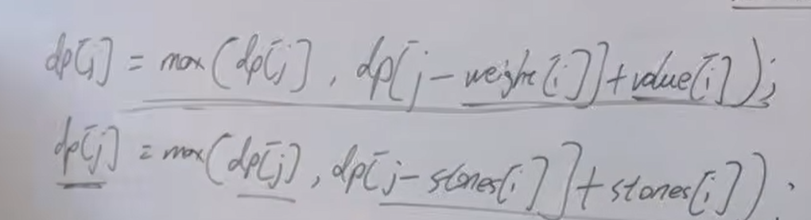
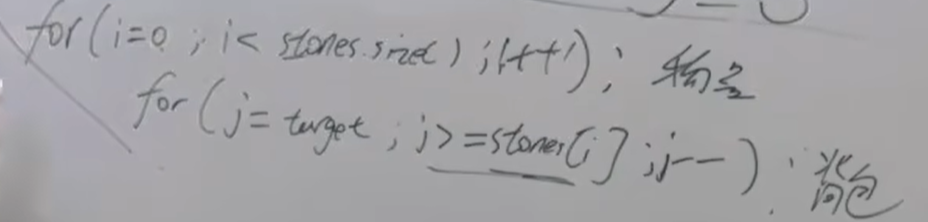
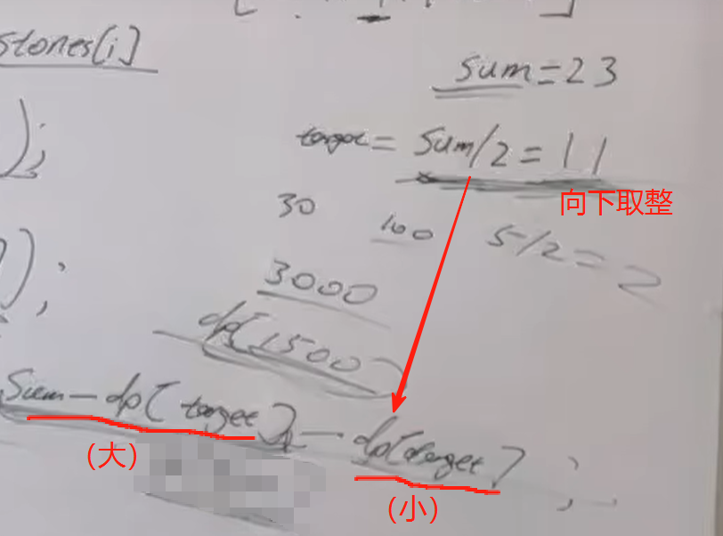

本题就和 昨天的 416. 分割等和子集 很像了，可以尝试先自己思考做一做。 
视频讲解：https://www.bilibili.com/video/BV14M411C7oV 
https://programmercarl.com/1049.%E6%9C%80%E5%90%8E%E4%B8%80%E5%9D%97%E7%9F%B3%E5%A4%B4%E7%9A%84%E9%87%8D%E9%87%8FII.html  

## 思路
！尽可能把石头分成重量相等的两堆  

### 1.dp含义
dp[j]: 装满容量为j的背包，它的最大重量是dp[j]  

### 2.递推公式  
  
 
`dp[j]=max(dp[j],dp[j-stones[i]]+stones[i])`  

### 3.初始化
- dp[0]=0   
- 非0下标也是0=>`max(dp[j],dp[j-nums[i]]+nums[i])`时不会让初始化的值覆盖掉要更新的值
- dp=[0]*1500
> 题目描述：  
> 30个石头，每个重量不超过100
> 共重：30*1000=3000  
> 所以背包最大重量：3000/2=1500

### 4.遍历顺序
 

### 5.相撞之后所剩重量  

