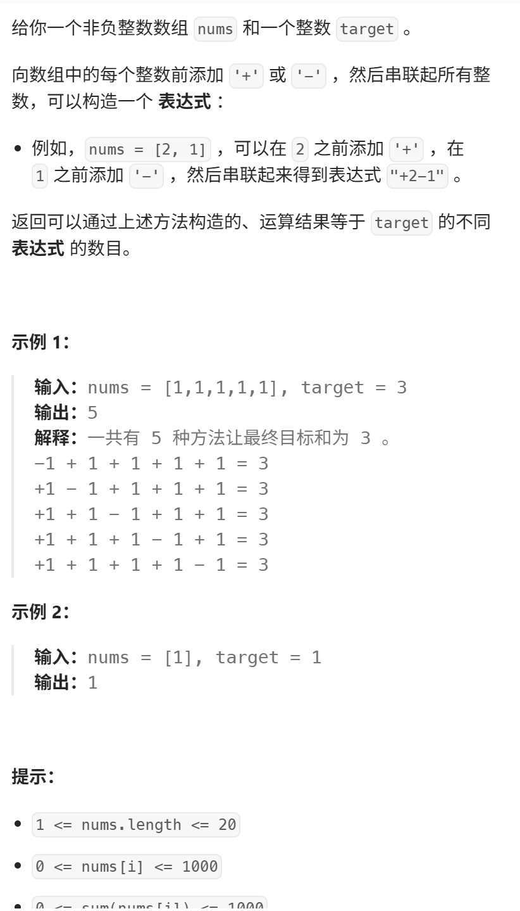
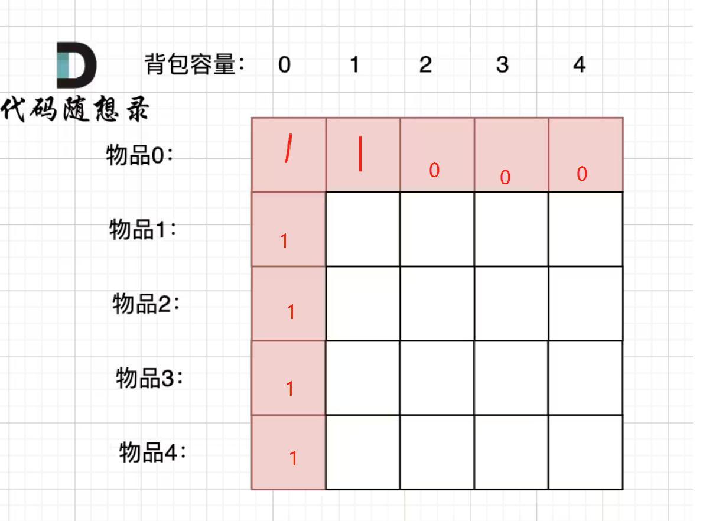
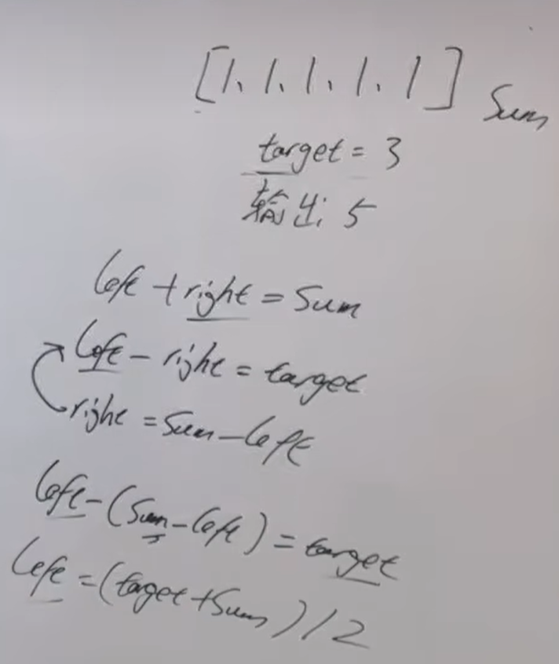
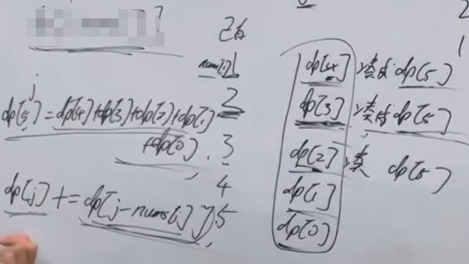
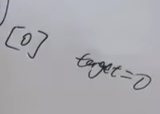
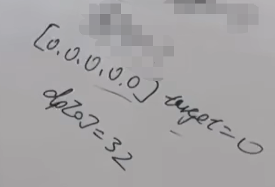
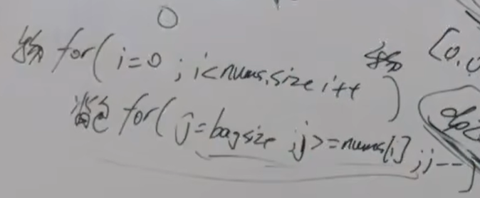

大家重点理解 递推公式：dp[j] += dp[j - nums[i]]，这个公式后面的提问 我们还会用到。  
视频讲解：https://www.bilibili.com/video/BV1o8411j73x
https://programmercarl.com/0494.%E7%9B%AE%E6%A0%87%E5%92%8C.html  




## 二维数组的思考方式
https://www.bilibili.com/read/cv37882178/?opus_fallback=1  
### 1.dp[i][j]的含义
物品0~i，去装容量为j的背包，有dp[i][j]种装法

### 2.递推公式  
```python
#  不放i,装满j容量的方法数量+ 放i,装满j容量的方法数量
dp[i][j]=dp[i-1][j]+dp[i-1][j-nums[i]]
```
### 3.初始化



## 思路
<font color=red>**求装满背包有多少种方法**</font>

分成：  
+法一个集合  
-法一个集合  

如果不能整除2，return 0 （找不出一种方法，使其运算后=target）

### 1.DP数组以及下际的含义
装满容量为j的背包，有 dp[j] 种方法  

### 2.递推公式


### 3.DP数组如何初始化
（通过递推公式思考，不要通过含义想）    
dp[0]=1  :  背包容量为0，有1种方法   
  
对↑累加（dp[0]+=dp[0]），得到↓  


### 4.遍历顺序

````python
#物品
for i in range(0,len(nums)): 
    #背包（为什么是倒序：每个物品只能选一次）
    for j in range(nums[i],bagsize,-1):  
````
