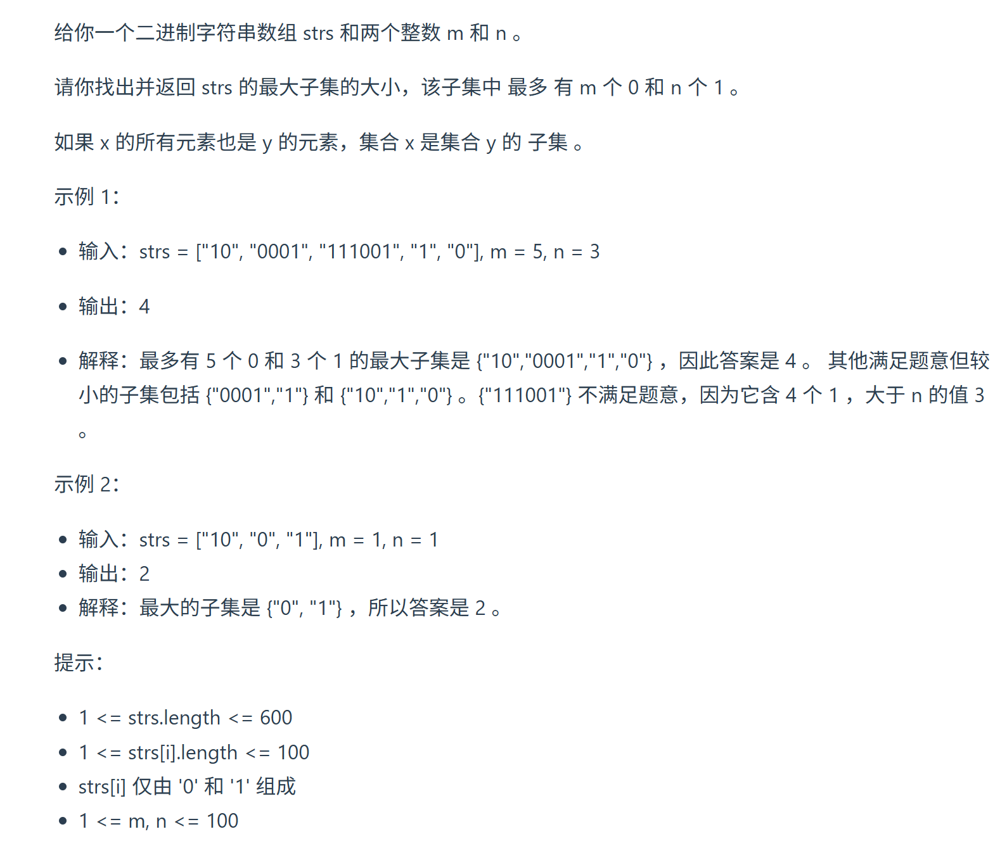
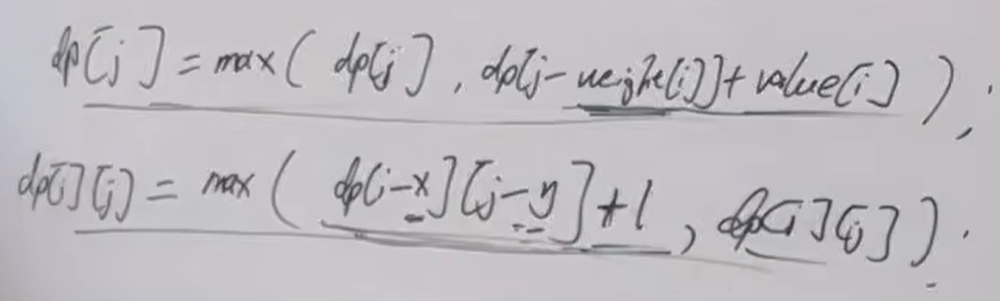

通过这道题目，大家先粗略了解， 01背包，完全背包，多重背包的区别，不过不用细扣，因为后面 对于 完全背包，多重背包 还有单独讲解。
视频讲解：https://www.bilibili.com/video/BV1rW4y1x7ZQ 
https://programmercarl.com/0474.%E4%B8%80%E5%92%8C%E9%9B%B6.html  

## 思路
### 1.DP数组以及下际的含义
- 变量（有3个）：m,n,最多装多少个元素  
- `dp[i][j]`:装满i个0，j个1，最多装了`dp[i][j]`个物品

### 2.递推公式
  

### 3.DP数组如何初始化

### 4.遍历顺序