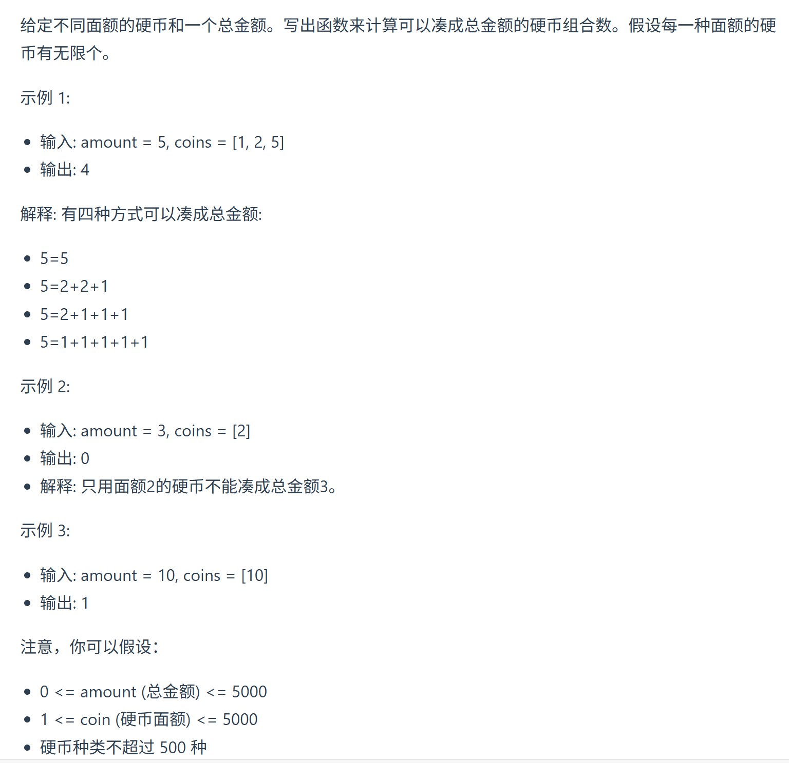
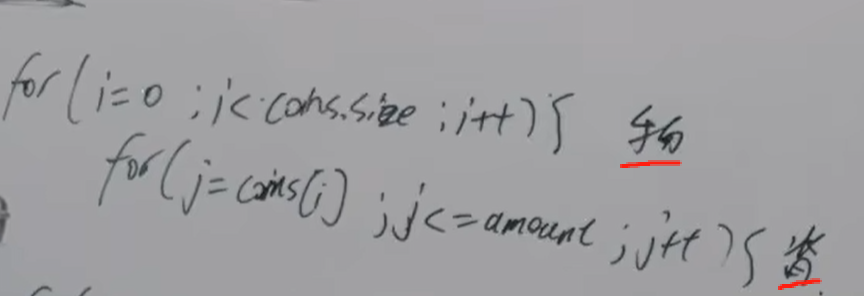

视频讲解：https://www.bilibili.com/video/BV1KM411k75j
https://programmercarl.com/0518.%E9%9B%B6%E9%92%B1%E5%85%91%E6%8D%A2II.html  


## 核心特征：
- 元素可以使用多次，组合问题
- 问：一共有多少种方法

## 思路    （与 494.目标和 类似）
### 1.DP数组以及下际的含义
`dp[j]`：装满容量为j的背包, 有`dp[j]`种办法
### 2.递推公式
`dp[j]+=dp[j-coins[j]]`  

### 3.DP数组如何初始化
根据递推公式：  
dp[0]=1

### 4.遍历顺序
本题问装满背包**有多少种方法**：不是纯完全背包  
<mark>先遍历物品后遍历背包：组合数</mark>
  
先遍历背包后遍历物品：排列数

### 5.打印DP数组

## 二维数组思考方式
设  
dp[i][j] = 只用前 i 种硬币（coins[0..i-1]）凑出金额 j 的方案数
状态转移：  
对第 i 种硬币面额 c = coins[i-1]，分两种情况：  
- 不用这枚硬币：dp[i-1][j]  
- 至少用 1 枚这枚硬币：dp[i][j - c]（因为可以重复使用）  
于是  
```python
dp[i][j] = dp[i-1][j] + dp[i][j - c]   (j >= c)
dp[i][j] = dp[i-1][j]                  (j < c)
```
```python
from typing import List

def change(amount: int, coins: List[int]) -> int:
    n = len(coins)
    # dp[i][j] 表示前 i 种硬币凑出 j 元的方案数
    dp = [[0] * (amount + 1) for _ in range(n + 1)]
    
    # 边界：0 种硬币只能凑出 0 元
    dp[0][0] = 1
    
    for i in range(1, n + 1):
        c = coins[i - 1]          # 当前硬币面额
        for j in range(amount + 1):
            if j < c:
                dp[i][j] = dp[i - 1][j]
            else:
                dp[i][j] = dp[i - 1][j] + dp[i][j - c]
    
    return dp[n][amount]

# 测试
print(change(5, [1, 2, 5]))  # 4
print(change(3, [2]))        # 0
print(change(10, [10]))      # 1
```
