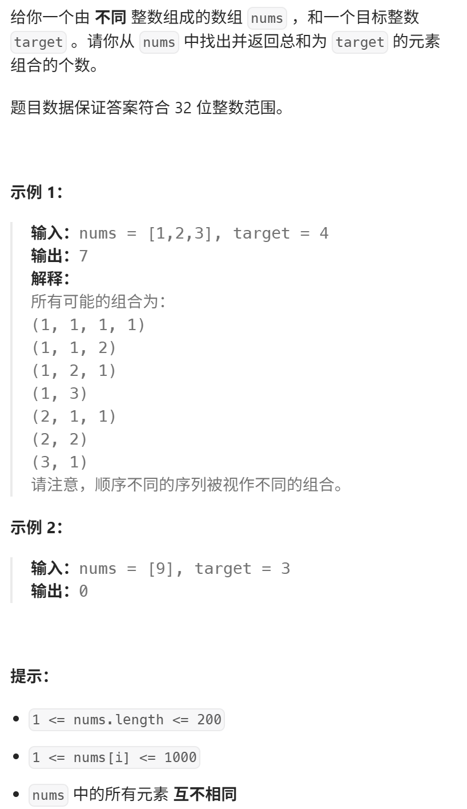

 377. 组合总和 Ⅳ  
视频讲解：https://www.bilibili.com/video/BV1V14y1n7B6
https://programmercarl.com/0377.%E7%BB%84%E5%90%88%E6%80%BB%E5%92%8C%E2%85%A3.html

## 核心特征：
- 元素可以使用多次，排列问题
- 问：一共有多少种方法

## 思路
### 1.DP数组以及下际的含义
### 2.递推公式

### 3.DP数组如何初始化

### 4.遍历顺序
先背包后物品是排列！
先物品后背包是组合！

### 5.打印DP数组

