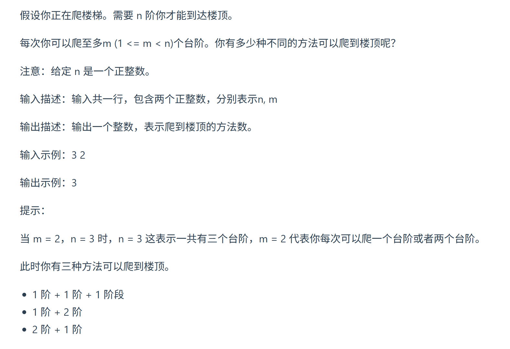

这道题目 爬楼梯之前我们做过，这次再用完全背包的思路来分析一遍 

https://programmercarl.com/0070.%E7%88%AC%E6%A5%BC%E6%A2%AF%E5%AE%8C%E5%85%A8%E8%83%8C%E5%8C%85%E7%89%88%E6%9C%AC.html  

## 核心特征：
- 元素可以使用多次，排列问题
- 问：一共有多少种方法

## 思路
### 1.DP数组以及下际的含义
### 2.递推公式

### 3.DP数组如何初始化

### 4.遍历顺序
### 5.打印DP数组