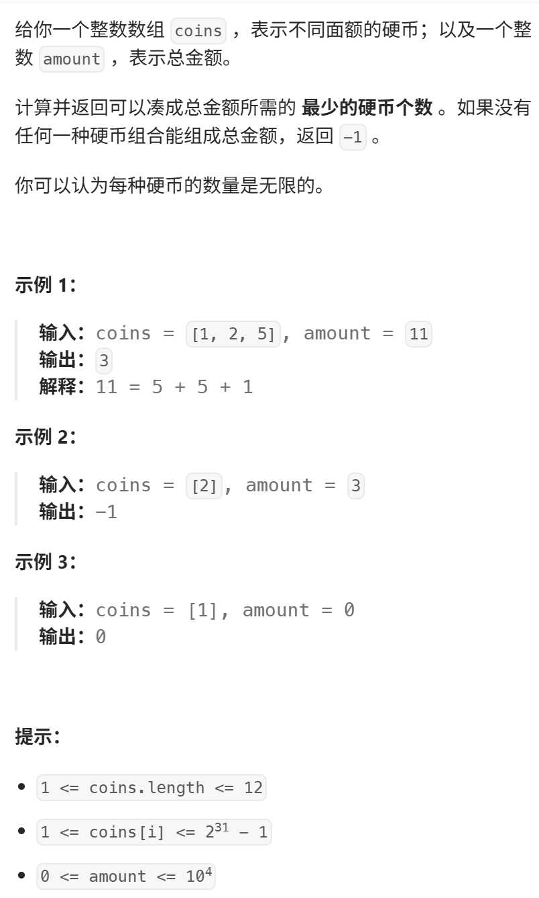
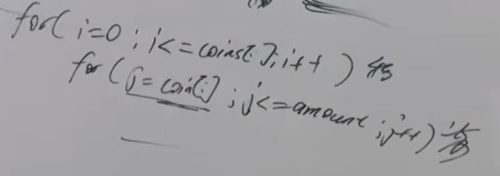

如果求组合数就是外层for循环遍历物品，内层for遍历背包。
如果求排列数就是外层for遍历背包，内层for循环遍历物品。

这句话结合本题 大家要好好理解。
视频讲解：https://www.bilibili.com/video/BV14K411R7yv
https://programmercarl.com/0322.%E9%9B%B6%E9%92%B1%E5%85%91%E6%8D%A2.html  

## 核心特征：
- 元素可以使用多次，不涉及组合问题、排列问题  
（问的是：最少需要的物品个数）
- 问：最少需要的物品个数

## 思路
### 1.DP数组以及下际的含义
装满容量为j的背包，最少物品为dp[j],求：dp[amount]
### 2.递推公式
`dp[j]=min(dp[j-coins[i]]+1,dp[j])`
>dp[j-coins[i]]+1：不放`coins[i]`需要的最少物品数，加上coins[i]这一个物品
### 3.DP数组如何初始化
- `dp[0]=0`
- 为了避免推导式求min被0覆盖，所以：  
非零下标初始成int_max

### 4.遍历顺序
不涉及组合问题、排列问题：  
>先物品，后背包、先背包，后物品   
均可  

### 5.打印DP数组