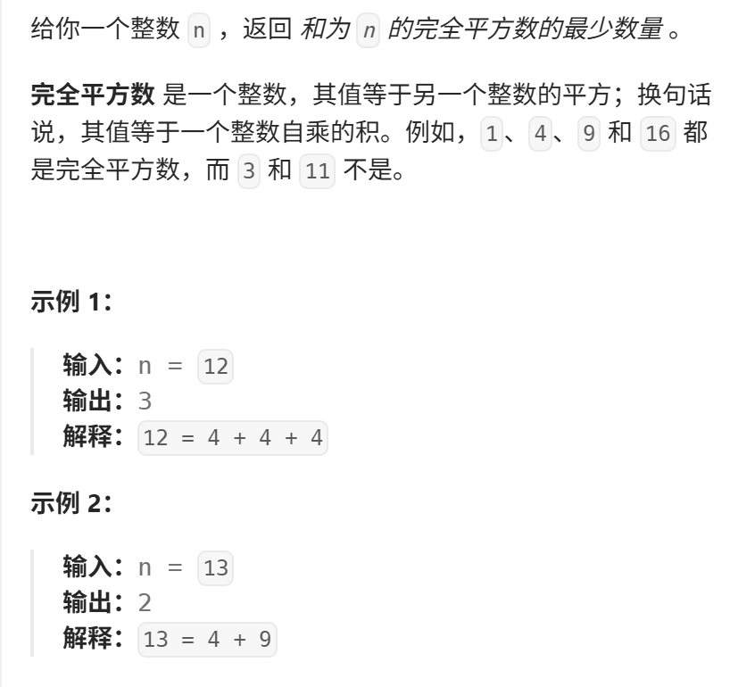
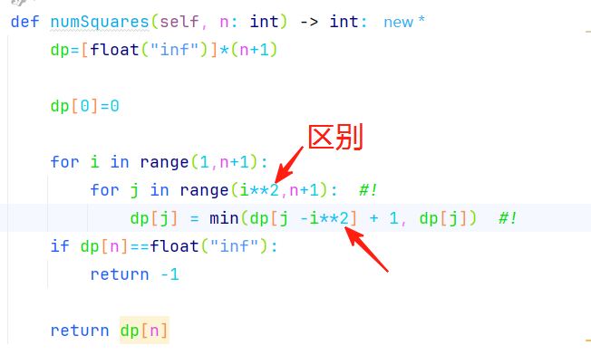

本题 和 322. 零钱兑换 基本是一样的，大家先自己尝试做一做 
视频讲解：https://www.bilibili.com/video/BV12P411T7Br
https://programmercarl.com/0279.%E5%AE%8C%E5%85%A8%E5%B9%B3%E6%96%B9%E6%95%B0.html  
  
## 核心特征：
1. 物品可以重复使用
2. 问：最少用多少个物品

