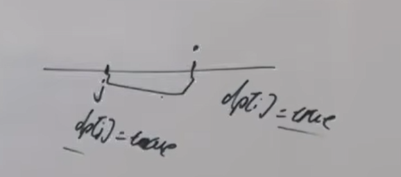
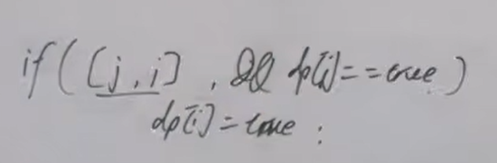
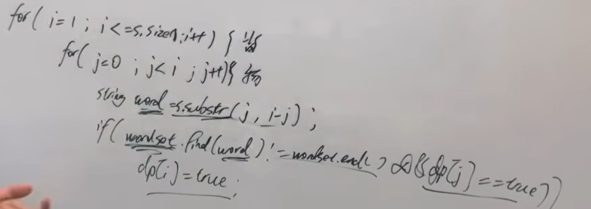

139.单词拆分 
视频讲解：https://www.bilibili.com/video/BV1pd4y147Rh
https://programmercarl.com/0139.%E5%8D%95%E8%AF%8D%E6%8B%86%E5%88%86.html

  
## 核心特征
- 字符串可以理解为容器，s里的字母可以理解为物品
- 完全背包
- 字典里的单词是有序的，排列问题 

## 思路
### 1.DP数组以及下际的含义
dp[i]:bool型
长度为i的字符串，是不是在wordDict里：dp[i]

### 2.递推公式
dp[j]在字典里，且j~i间的单词也在字典里
=>dp[i]就为true

  

### 3.DP数组如何初始化
dp[0]=true(由递推公式而来)

### 4.遍历顺序

### 5.打印DP数组