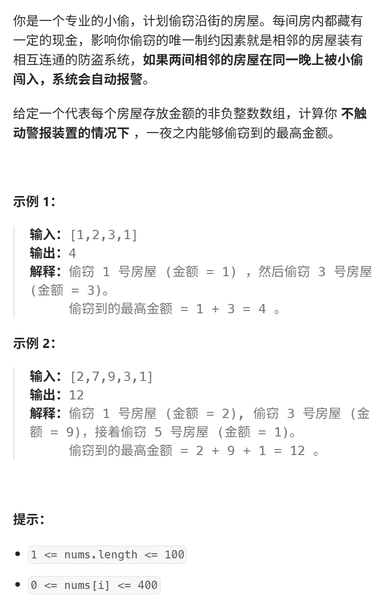
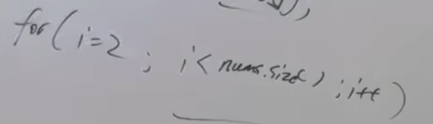

视频讲解：https://www.bilibili.com/video/BV1Te411N7SX
https://programmercarl.com/0198.%E6%89%93%E5%AE%B6%E5%8A%AB%E8%88%8D.html  

## 思路
### 1.DP数组以及下际的含义
考虑下标 i，所能偷的最大金币为dp[i]  
求：dp[len(nums)-1]
### 2.递推公式
- 偷 i：`dp[i-2]+nums[i]`  
- 不偷 i:`dp[i-1]`  
- `dp[i]=max(dp[i-2]+nums[i],dp[i-1])`

### 3.DP数组如何初始化
`dp[0]=nums[0]`
`dp[1]=max(nums[0],nums[1])`

### 4.遍历顺序
`for i in range(2,len(nums),1)`

### 5.打印DP数组