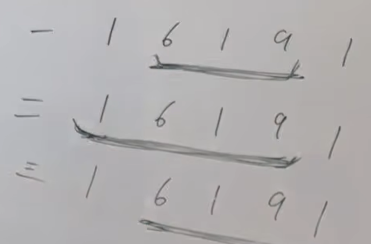

视频讲解：https://www.bilibili.com/video/BV1oM411B7xq
https://programmercarl.com/0213.%E6%89%93%E5%AE%B6%E5%8A%AB%E8%88%8DII.html 

## 区别
有环

## 思路
### 三种情况
1.不考虑首、尾元素  
2.不考虑尾元素  
3.不考虑首元素  

情况2,3包含了情况1


```python
from typing import List


class Solution:
    def rob(self, nums: List[int]) -> int:
        result1=self.robRange(nums,0,len(nums) - 2)
        result2=self.robRange(nums,1,len(nums)-1)
        return max(result1,result2)

    def robRange(self, nums, start, end):
        if end == start:
            return nums[start]

        # dp数组的长度
        length = end - start + 1
        dp = [0] * length

        # 使用相对索引访问dp数组
        dp[0] = nums[start]
        dp[1] = max(nums[start], nums[start + 1])

        # 循环也应该使用相对索引
        for i in range(2, length):  # i是相对索引
            # dp[i]对应原始索引start+i的位置
            dp[i] = max(dp[i - 1], dp[i - 2] + nums[start + i])

        return dp[length - 1]

```


