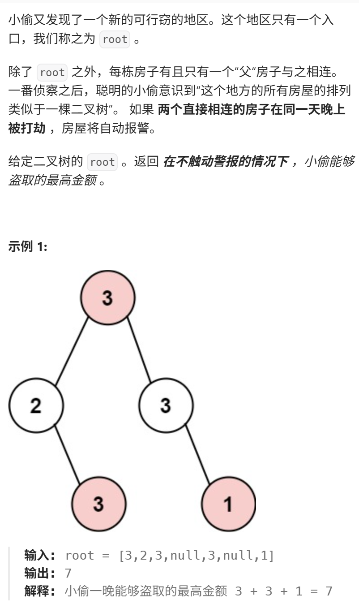
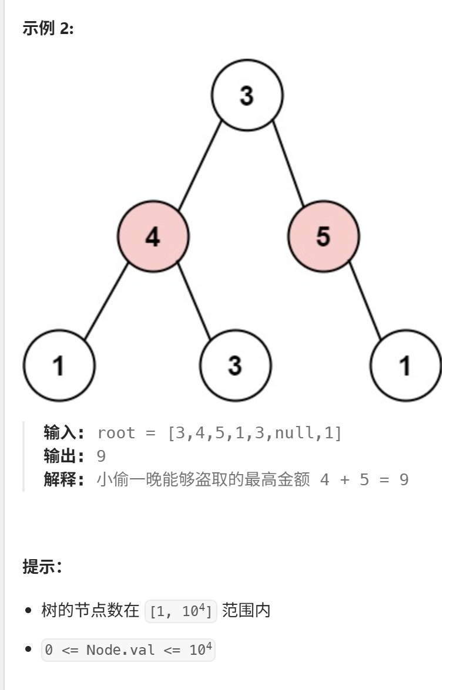
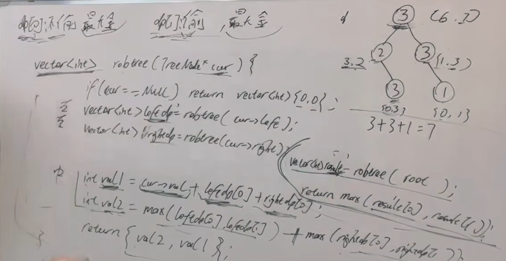

视频讲解：https://www.bilibili.com/video/BV1H24y1Q7sY
https://programmercarl.com/0337.%E6%89%93%E5%AE%B6%E5%8A%AB%E8%88%8DIII.html




## 思路   二叉树+动态规划
### 1.dp数组含义
dp[0]: 不偷当前节点的最大价值  
dp[1]: 偷当前节点的最大价值  



```python
# Definition for a binary tree node.
# class TreeNode:
#     def __init__(self, val=0, left=None, right=None):
#         self.val = val
#         self.left = left
#         self.right = right
class Solution:
    def rob(self, root: Optional[TreeNode]) -> int:
        # dp数组（dp table）以及下标的含义：
        # 1. 下标为 0 记录 **不偷该节点** 所得到的的最大金钱
        # 2. 下标为 1 记录 **偷该节点** 所得到的的最大金钱
        dp = self.traversal(root)
        return max(dp)

    # 要用后序遍历, 因为要通过递归函数的返回值来做下一步计算
    def traversal(self, node):
        
        # 递归终止条件，就是遇到了空节点，那肯定是不偷的
        if not node:
            return (0, 0)

        left = self.traversal(node.left)
        right = self.traversal(node.right)

        # 不偷当前节点, 偷子节点
        val_0 = max(left[0], left[1]) + max(right[0], right[1])

        # 偷当前节点, 不偷子节点
        val_1 = node.val + left[0] + right[0]

        return (val_0, val_1)
```