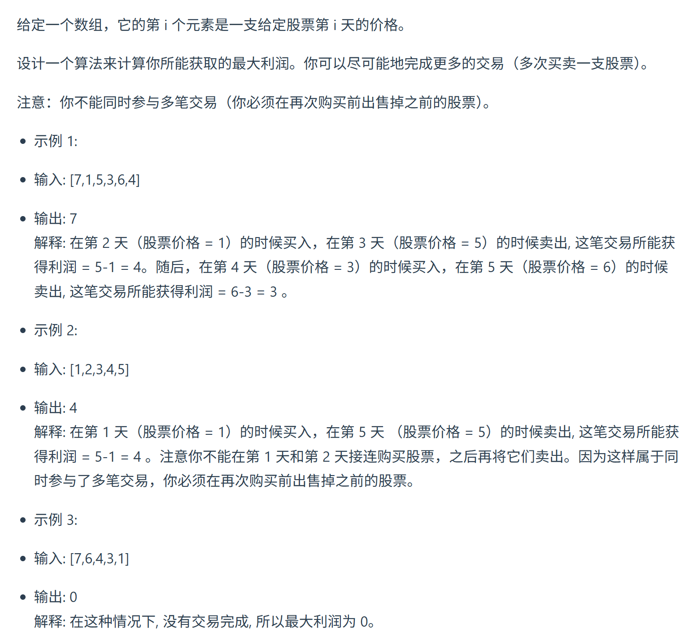

视频讲解：https://www.bilibili.com/video/BV1D24y1Q7Ls
https://programmercarl.com/0122.%E4%B9%B0%E5%8D%96%E8%82%A1%E7%A5%A8%E7%9A%84%E6%9C%80%E4%BD%B3%E6%97%B6%E6%9C%BAII%EF%BC%88%E5%8A%A8%E6%80%81%E8%A7%84%E5%88%92%EF%BC%89.html  

## 特点
可以买卖多次
## 思路
### 1.DP数组以及下际的含义
dp[i][0]:第i天不持有股票的最大**金额**   
dp[i][1]:第i天持有股票的最大金额   

### 2.递推公式
- 第i天持有股票即dp[i][0]， 由两个状态推出来：  
  - 第i-1天就持有股票，那么就保持现状，所得现金就是昨天持有股票的所得现金 即：`dp[i - 1][0]`  
  - <mark>第i天买入股票：`dp[i-1][1]-prices[i]`  
    </mark>
=>`dp[i][0] = max(dp[i - 1][0],dp[i-1][1] -prices[i])`
- 第i天不持有股票即dp[i][1]， 也由两个状态推出来:
    - 第i-1天就不持有股票,保持现状，dp[i - 1][1]  
    - 第i天卖出股票:prices[i] + dp[i - 1][0]   
  
=>`dp[i][1] = max(dp[i - 1][1], prices[i] + dp[i - 1][0])`
### 3.DP数组如何初始化

dp[0][0]=-price[0]
dp[0][1]=0  

### 4.遍历顺序
`for i in range(1,len(prices))`  

求：`dp[len-1][1]`

### 5.打印DP数组