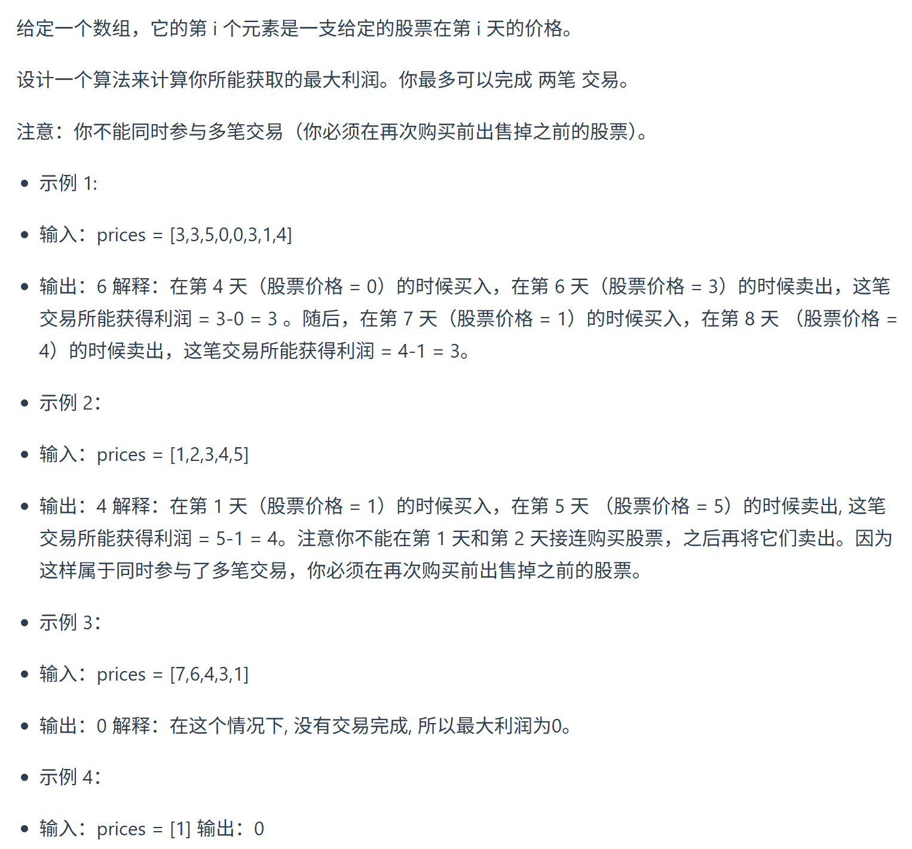

这道题一下子就难度上来了，关键在于至多买卖两次，这意味着可以买卖一次，可以买卖两次，也可以不买卖。
视频讲解：https://www.bilibili.com/video/BV1WG411K7AR
https://programmercarl.com/0123.%E4%B9%B0%E5%8D%96%E8%82%A1%E7%A5%A8%E7%9A%84%E6%9C%80%E4%BD%B3%E6%97%B6%E6%9C%BAIII.html


  ## 特点
最多可以买卖2次


## 思路
### 1.DP数组以及下际的含义
dp[i][0] ：不操作  
dp[i][1] ：第1次持有  
dp[i][2] ：第1次不持有  
dp[i][3] ：第2次持有  
dp[i][4] ：第2次不持有  

### 2.递推公式
- 不操作
`dp[i][0]=dp[i-1][0]`
-  第1次持有  
`dp[i][1]=max(dp[i-1][1],dp[i-1[0]-prices[i]])`  
=>`dp[i][1]=max(dp[i-1][1],0-prices[i]])`  
-  第1次不持有  
`dp[i][2]=max(dp[i-1][2],dp[i-1][1]+prices[i])`
-   第2次持有   
`dp[i][3]=max(dp[i-1][3],dp[i-1][2]-prices[i])   `
-   第2次不持有  
`dp[i][4]=max(dp[i-1][4],dp[i-1][3]+prices[i])  `
### 3.DP数组如何初始化
```python
 dp[0][0]=0              
 dp[0][1]=-price[0]      
 dp[0][2]=0              
 dp[0][3]=0 #(同一天买卖)     
 dp[0][4]=0              
```
### 4.遍历顺序
`for i in range(1,len(prices))`
   
求：`dp[len(prices)-1][4]` 

### 5.打印DP数组