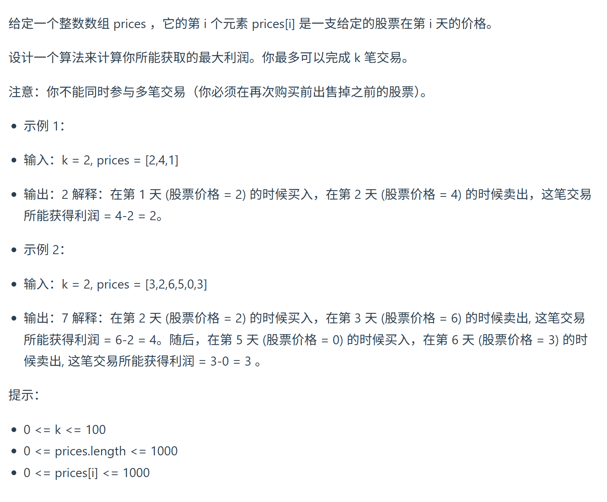
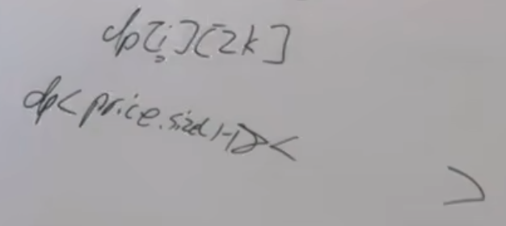
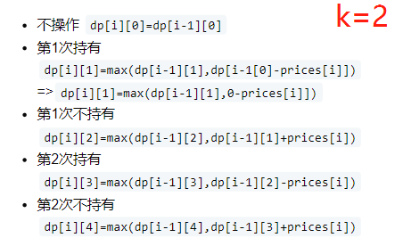

本题是123.买卖股票的最佳时机III 的进阶版  
视频讲解：https://www.bilibili.com/video/BV16M411U7XJ
https://programmercarl.com/0188.%E4%B9%B0%E5%8D%96%E8%82%A1%E7%A5%A8%E7%9A%84%E6%9C%80%E4%BD%B3%E6%97%B6%E6%9C%BAIV.html
力扣:https://leetcode.cn/problems/best-time-to-buy-and-sell-stock-iv/description/



## 特征
最多可以完成 k 笔交易

## 思路
### 1.DP数组以及下际的含义
第i次持有:dp[i][j+1]  
第i次不持有:dp[i][j+2]
- 求：`dp[len(prices)-1][2k+1]`

### 2.递推公式
j+1: 买入
j+2： 卖出

```python
for j in range(0,2*k,2): #!截止到2*k:带入场景试
    dp[i][j+1]=max(dp[i-1][j+1],dp[i-1][j]-prices[i])
    dp[i][j+2]=max(dp[i-1][j+2],dp[i-1][j+1]+prices[i])
```

### 3.DP数组如何初始化
```python
for j in range(1,2*k,2):
    #dp[0][j+1]=-prices[0]
    #range里是从1开始的
    dp[0][j]=-prices[0]
```

### 4.遍历顺序
正序：从前往后

### 5.打印DP数组