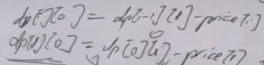

本题加了一个冷冻期，状态就多了，有点难度，大家要把各个状态分清，思路才能清晰 
视频讲解：https://www.bilibili.com/video/BV1rP4y1D7ku

https://programmercarl.com/0309.%E6%9C%80%E4%BD%B3%E4%B9%B0%E5%8D%96%E8%82%A1%E7%A5%A8%E6%97%B6%E6%9C%BA%E5%90%AB%E5%86%B7%E5%86%BB%E6%9C%9F.html  

力扣：https://leetcode.cn/problems/best-time-to-buy-and-sell-stock-with-cooldown/

## 思路
### 1.DP数组以及下际的含义
dp[i][0]：持股  
状态1：dp[i][1] 保持卖出股票  
状态2：dp[i][2] 第i天卖出股票
状态3：dp[i][3]冷冻期
### 2.递推公式
- `dp[i][0]`，求max:  
    - 前一天持股：`dp[i-1][0]`
    - 前一天是冷冻期，第i天买股票：`dp[i-1][3]-prices[i]`  
    - 前一天是冷冻期后不持有股，第i天买股票：`dp[i-1][1]-prices[i] `   
- `dp[i][1]`,求max：
    - 前一天卖出股票：`dp[i-1][1]`  
    - 前一天是冷冻期，第i天是卖出股票的状态：`dp[i-1][3]`  
- `dp[i][2]`
    - `dp[i-1][0]+prices[i]`
- `dp[i][3]`  
    - `dp[i-1][2]`

### 3.DP数组如何初始化
`dp[0][0]=-prices[0]`  
`dp[0][1]=0`(不合理的状态，从递推公式看，需要初始化成多少)  

`dp[0][2]=0`  
`dp[0][3]=0`   

### 4.遍历顺序
正序：从前往后  
`for i in range(1,len(prices))` 

求：`max(dp[(len(prices)-1)][1],dp[(len(prices)-1)][2],dp[(len(prices)-1)][3])`
### 5.打印DP数组

