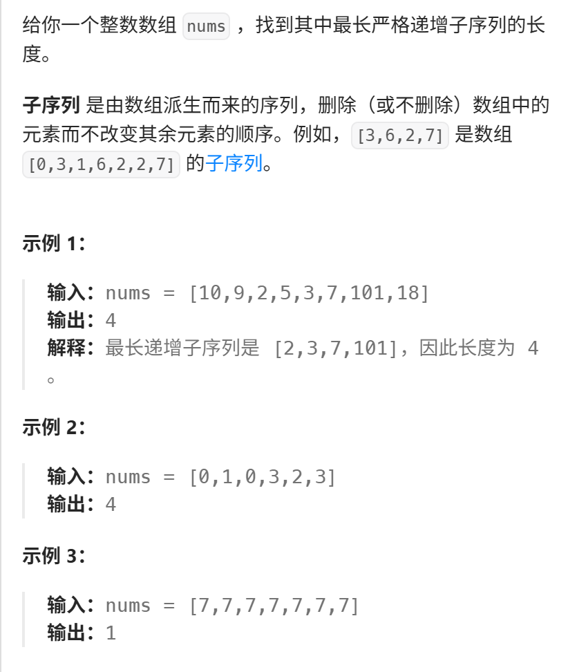

今天开始正式子序列系列，本题是比较简单的，感受感受一下子序列题目的思路。 

视频讲解：https://www.bilibili.com/video/BV1ng411J7xP
https://programmercarl.com/0300.%E6%9C%80%E9%95%BF%E4%B8%8A%E5%8D%87%E5%AD%90%E5%BA%8F%E5%88%97.html

力扣：https://leetcode.cn/problems/longest-increasing-subsequence/description/



## 思路
### 1.DP数组以及下际的含义
`dp[i]`:以`nums[i]`结尾的最长递增子序列的长度  

### 2.递推公式
```python
if nums[j]<nums[i]:
    dp[i]=max(dp[j]+1,dp[i])
```
### 3.DP数组如何初始化
dp[0]=1
### 4.遍历顺序
- 正序：这样才能利用之前对升序排列的结果
```
for (i=1;i<nums.size;i++):
    for (j=0,j<i,j++)
```

- 求：
最长递增子序列的长度  
需要再遍历一遍dp数组，找dp里的最大值
```python
result=0
for i in range(0,len(nums),1):
    result=max(result,dp[i])
```

### 5.打印DP数组
