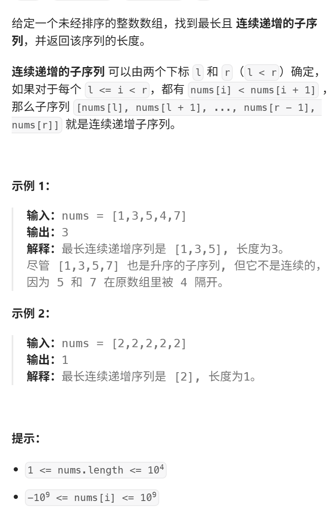

本题相对于昨天的动态规划：300.最长递增子序列 最大的区别在于“连续”。 先尝试自己做做，感受一下区别  
视频讲解：https://www.bilibili.com/video/BV1bD4y1778v
https://programmercarl.com/0674.%E6%9C%80%E9%95%BF%E8%BF%9E%E7%BB%AD%E9%80%92%E5%A2%9E%E5%BA%8F%E5%88%97.html  

力扣：https://leetcode.cn/problems/longest-continuous-increasing-subsequence/description/  


## 思路
### 1.DP数组以及下际的含义
dp[i]:以i为结尾的最长连续递增序列的长度

### 2.递推公式
```python
if nums[i]>nums[i-1]:
    dp=dp[i-1]+1
```
### 3.DP数组如何初始化
dp[0]=1
### 4.遍历顺序
- 正序
```python
for i in range(1,len(nums)):
```
- 求：dp里的最大值
### 5.打印DP数组


