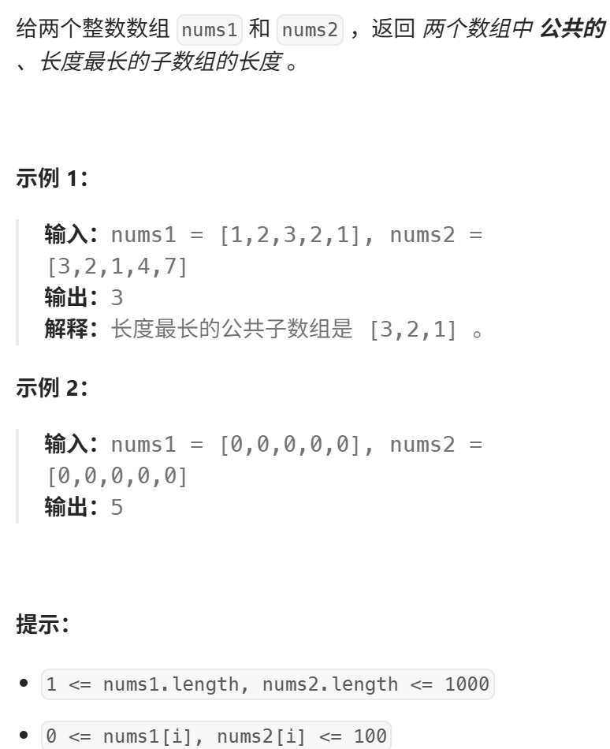

稍有难度，要使用二维dp数组了
视频讲解：https://www.bilibili.com/video/BV178411H7hV
https://programmercarl.com/0718.%E6%9C%80%E9%95%BF%E9%87%8D%E5%A4%8D%E5%AD%90%E6%95%B0%E7%BB%84.html

力扣：https://leetcode.cn/problems/maximum-length-of-repeated-subarray/description/  


## 思路
### 1.DP数组以及下际的含义
`dp[i][j]`:以`i-1`为结尾的nums1，以`j-1`为结尾的nums2的最大重复子数组长度  
(要定义成i-1的原因：使代码更简洁)
### 2.递推公式
```python
if nums[i-1]==nums[j-1]:
    dp[i][j]=dp[i-1][j-1]+1
```
 
### 3.DP数组如何初始化
`dp[i][0]=0`  
`dp[0][j]=0`

### 4.遍历顺序
```python
for i in range(1,len(nums1)+1):
    for j in range(1,len(nums2)+1):
```

- 求
max(dp)
### 5.打印DP数组

```python
class Solution:
    def findLength(self, nums1: List[int], nums2: List[int]) -> int:
        # dp[i][j] 表示以nums2[i]和nums1[j]结尾的最长公共子数组长度
        dp = [[0 for _ in range(len(nums1))] for _ in range(len(nums2))]
        
        result = 0
        
        # 处理第一行：nums2[0]与nums1的每个元素比较
        for j in range(len(nums1)):
            if nums2[0] == nums1[j]:
                dp[0][j] = 1
                result = max(result, dp[0][j])
        
        # 处理第一列：nums1[0]与nums2的每个元素比较
        for i in range(len(nums2)):
            if nums1[0] == nums2[i]:
                dp[i][0] = 1
                result = max(result, dp[i][0])
        
        # 填充其余位置
        for i in range(1, len(nums2)):
            for j in range(1, len(nums1)):
                if nums1[j] == nums2[i]:
                    dp[i][j] = dp[i-1][j-1] + 1
                    result = max(result, dp[i][j])
                else:
                    dp[i][j] = 0
        
        return result
```
