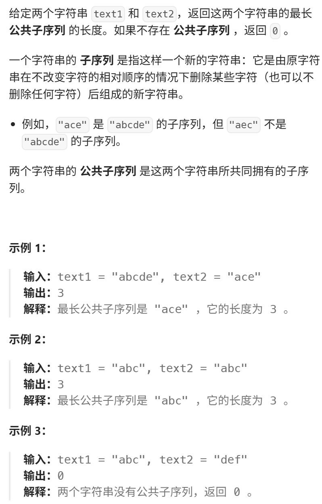

体会一下本题和 718. 最长重复子数组 的区别  
视频讲解：https://www.bilibili.com/video/BV1ye4y1L7CQ
https://programmercarl.com/1143.%E6%9C%80%E9%95%BF%E5%85%AC%E5%85%B1%E5%AD%90%E5%BA%8F%E5%88%97.html

力扣：https://leetcode.cn/problems/longest-common-subsequence/description/  


## 思路
### 1.DP数组以及下际的含义
dp[i][j]:以[0,i-1]为区间的text1 和 以[0,j-1]为区间的text2的最长公共子序列长度为dp[i][j]  

### 2.递推公式
```python
if text1[i-1]==text2[j-1]:
    dp[i][j]=dp[i-1][j-1]
else:
    dp[i][j]=max(dp[i-1][j],dp[i][j-1])

```

### 3.DP数组如何初始化
dp[i][0]=dp[0][j]=0
### 4.遍历顺序
```python
for i in range(1,len(text1)+1):
    for j in range(1,len(text2)+1):
```
### 5.打印DP数组