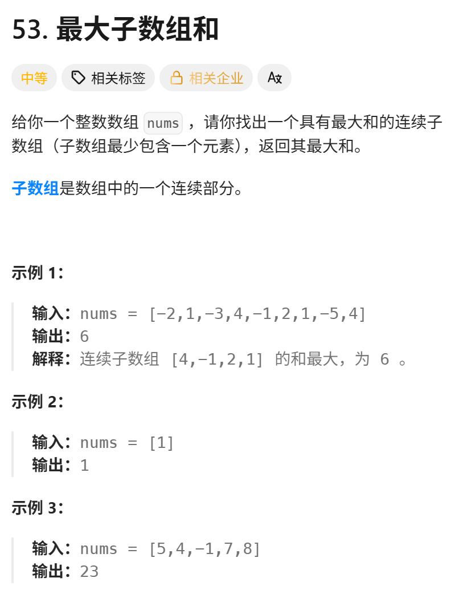
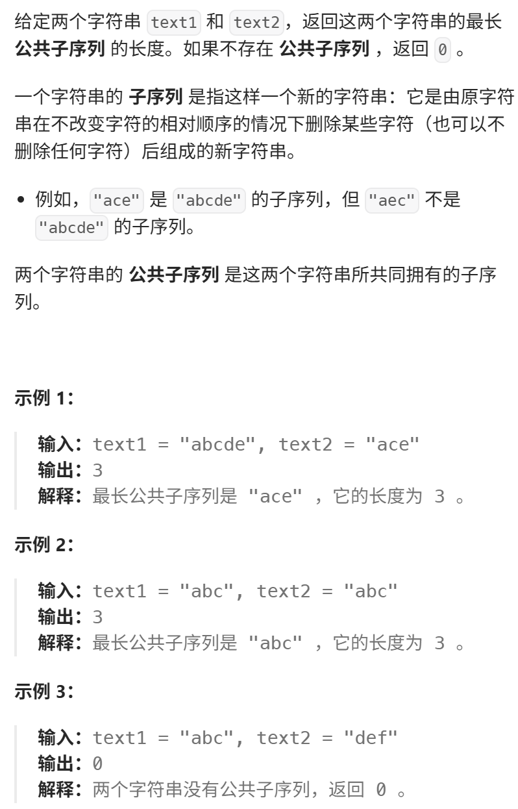

但相对于刚讲过 392.判断子序列，本题 就有难度了 ，感受一下本题和  392.判断子序列 的区别。 

https://programmercarl.com/0115.%E4%B8%8D%E5%90%8C%E7%9A%84%E5%AD%90%E5%BA%8F%E5%88%97.html

力扣：https://leetcode.cn/problems/distinct-subsequences/description/


## 思路
### 1.DP数组以及下际的含义
dp[i][j]:以i-1为结尾的s中有以j-1为结尾的t的个数  

### 2.递推公式
```python
if s[i-1]=s[j-1]:
    dp[i][j]=dp[i-1][j-1]+dp[i-1][j]
else:
    dp[i][j]=dp[i-1][j]
```

### 3.DP数组如何初始化
dp[0][j]=0  
dp[i][0]=1  
dp[0][0]=1  

### 4.遍历顺序

```python
for i in range(1,len(s)+1)
    for j in range(1,len(t)+1)
```

### 5.打印DP数组

