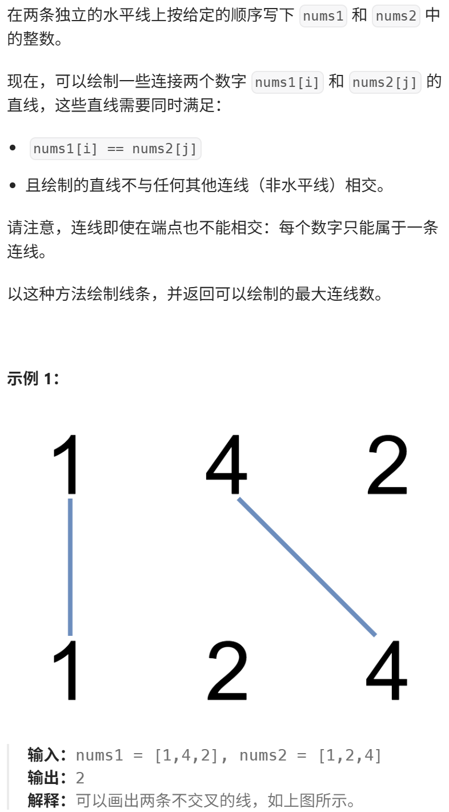

其实本题和 1143.最长公共子序列 是一模一样的，大家尝试自己做一做。
视频讲解：https://www.bilibili.com/video/BV1h84y1x7MP
https://programmercarl.com/1035.%E4%B8%8D%E7%9B%B8%E4%BA%A4%E7%9A%84%E7%BA%BF.html

力扣：https://leetcode.cn/problems/uncrossed-lines/description/  

## 本质：
最长公共子序列
