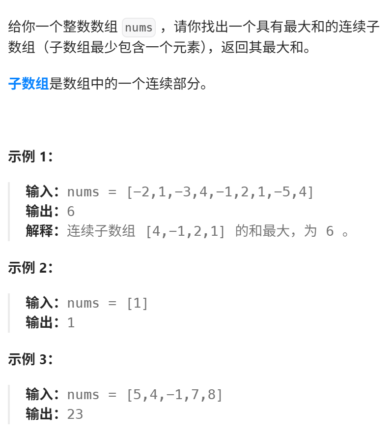

本题和动态规划：115.不同的子序列 相比，其实就是两个字符串都可以删除了，情况虽说复杂一些，但整体思路是不变的。
https://programmercarl.com/0583.%E4%B8%A4%E4%B8%AA%E5%AD%97%E7%AC%A6%E4%B8%B2%E7%9A%84%E5%88%A0%E9%99%A4%E6%93%8D%E4%BD%9C.html


力扣：https://leetcode.cn/problems/delete-operation-for-two-strings/  


## 思路
### 1.DP数组以及下际的含义
dp[i][j]:要使 以i-1为结尾的s 和j-1为结尾的t相同所需要的最少删除次数是dp[i][j]  

### 2.递推公式
```python
if word1[i-1]==word2[j-1]:
    dp[i][j]=dp[i-1][j-1]
else:
    dp[i][j]=min(dp[i-1][j]+1,dp[i][j-1]+1,dp[i-1][j-1]+2)
```
> 如果word1[i-1]！=word2[j-1]：  
> ①删word1里的字母，word2不变，删除+1
> ②删word2里的字母，word1不变，删除+1
> ③删word1和word2的字母，删除操作数量+2
### 3.DP数组如何初始化
dp[i][0]=i
dp[0][j]=j
### 4.遍历顺序
正序
```python
for i in range(1,len(word2)+1):
    for j in range(1,len(word1)+1):
```
### 5.打印DP数组

## 思路二
求：  
- 最长公共子序列的长度，  
- 然后用（word1的长度-公共子序列的长度），  
- 然后再+ （word2的长度-公共子序列的长度）