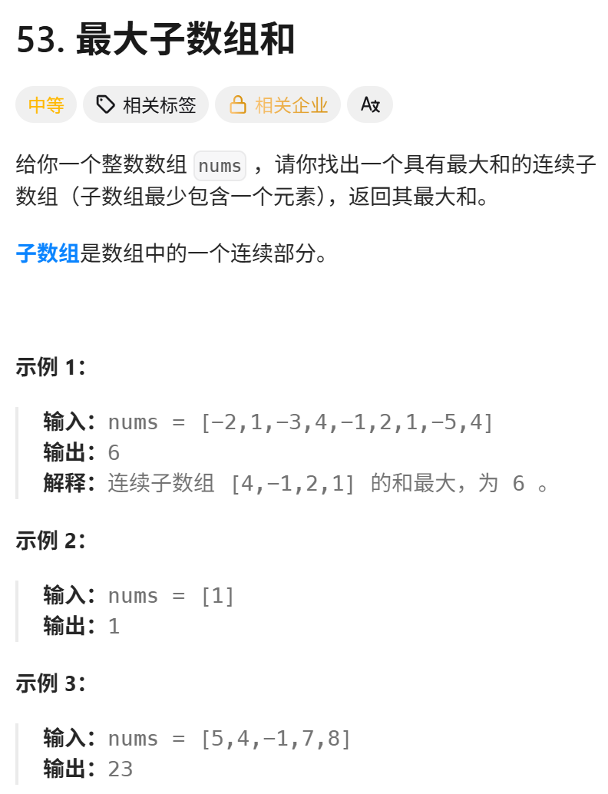

这道题我们用贪心做过，这次 再用dp来做一遍 
视频讲解：https://www.bilibili.com/video/BV19V4y1F7b5
https://programmercarl.com/0053.%E6%9C%80%E5%A4%A7%E5%AD%90%E5%BA%8F%E5%92%8C%EF%BC%88%E5%8A%A8%E6%80%81%E8%A7%84%E5%88%92%EF%BC%89.html

力扣：https://leetcode.cn/problems/maximum-subarray/description/  

## 思路
### 1.DP数组以及下际的含义
dp[i]:以i为结尾的nums[i]的最大子序和为dp[i]  

### 2.递推公式
- 从头开始计算：`dp[i-1]+nums[i]`
- 从`nums[i]`开始计算：`nums[i]`
=>`dp[i]=max(dp[i-1]+nums[i],nums[i])`  
### 3.DP数组如何初始化
`dp[0]=nums[0]`

### 4.遍历顺序
正序：
`for i in range(1,len(nums)):`  
 求：(最大连续自序和不一定是以len(nums)结尾的)  

max(dp)
### 5.打印DP数组
