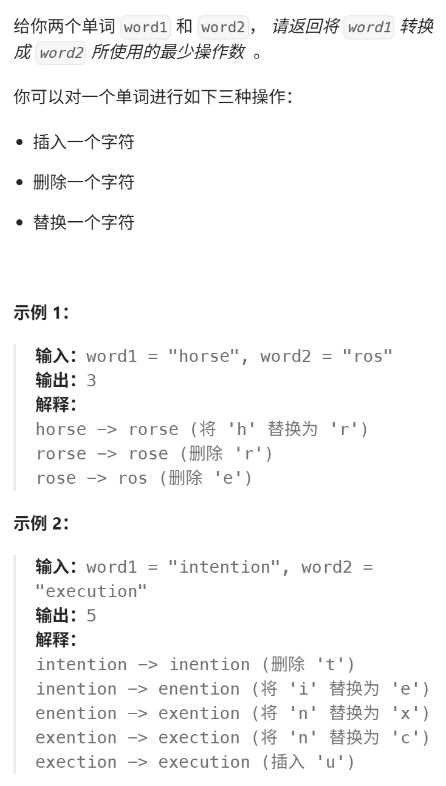

最终我们迎来了编辑距离这道题目，之前安排题目都是为了 编辑距离做铺垫。 

https://programmercarl.com/0072.%E7%BC%96%E8%BE%91%E8%B7%9D%E7%A6%BB.html

力扣：https://leetcode.cn/problems/edit-distance/description/


## 思路
### 1.DP数组以及下际的含义
dp[i][j]:使 以i-1为结尾的word1，以j-1为结尾的word2 相同，所需要的最少操作次数

### 2.递推公式
```python
if word1[i-1]==word2[j-1]:
    dp[i][j]=dp[i-1][j-1]
else:
    dp[i][j]=min(dp[i-1][j]+1,dp[i][j-1]+1,dp[i-1][j-1]+1)
```
>- dp[i-1][j-1]+1:替换字母（eg:"ab" vs. "ac"）  
>-  dp[i][j-1]+1:删除word2里的字母  
>-  dp[i-1][j]+1：删除word1里的字母  
### 3.DP数组如何初始化
dp[i][0]=i  
dp[0][j]=j
dp[0][0]=0
### 4.遍历顺序
- 从左向右，从上到下
```python
for i in range(1,len(word1)+1):
    for j in range(1,len(word2)+1):
```
- 求：dp[len(word1)][len(word2)]
### 5.打印DP数组