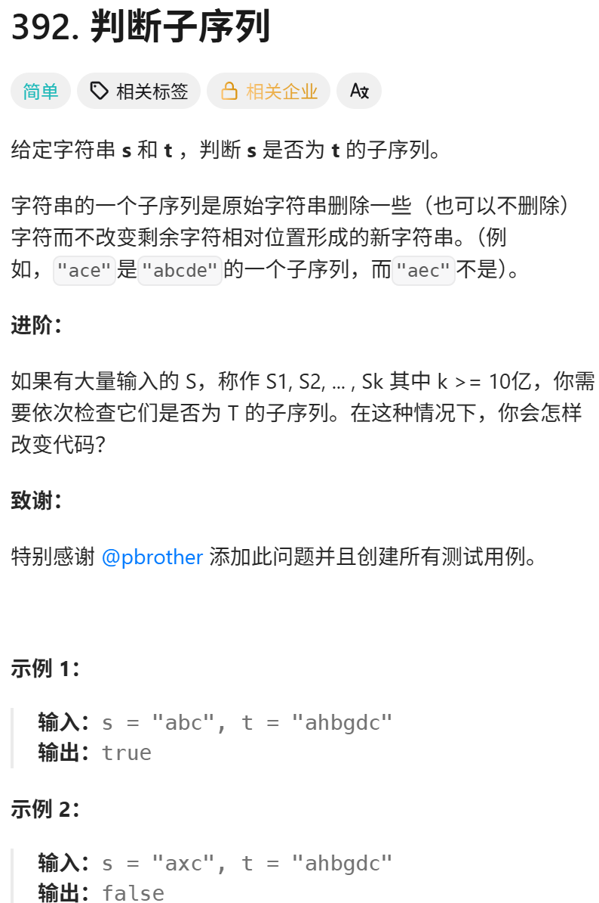

这道题目算是 编辑距离问题 的入门题目（毕竟这里只是涉及到减法），慢慢的，后面就要来解决真正的 编辑距离问题了

https://programmercarl.com/0392.%E5%88%A4%E6%96%AD%E5%AD%90%E5%BA%8F%E5%88%97.html

力扣：https://leetcode.cn/problems/is-subsequence/  


## 特征：编辑距离类问题
只需要删除t里的元素

## 思路
### 1.DP数组以及下际的含义
dp[i][j]:以i-1为结尾的字符串s和以j-1为结尾的字符串t的相同子序列长度
### 2.递推公式
```python
if s[i-1]==t[j-1]:
    dp[i][j]=dp[i-1][j-1]+1
else:
    dp[i][j]=dp[i][j-1]
```
### 3.DP数组如何初始化
- dp[i][0]=0  
- dp[0][j]=0
### 4.遍历顺序
```python
for i in range(1,len(s)+1)
    for j in range(1,len(t)+1)
```
### 5.打印DP数组