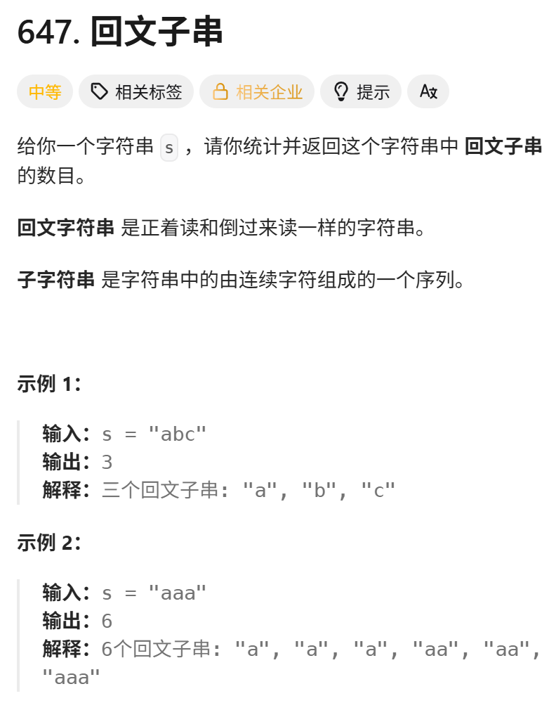
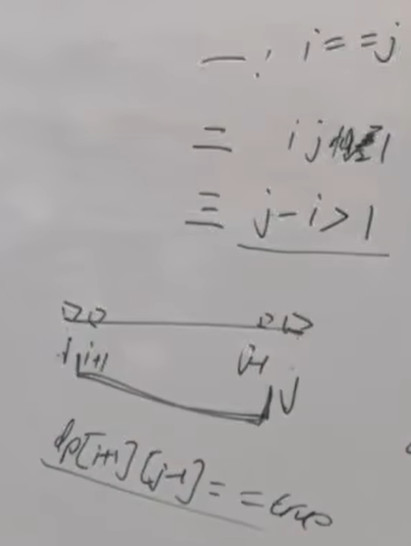

动态规划解决的经典题目，如果没接触过的话，别硬想 直接看题解。
https://programmercarl.com/0647.%E5%9B%9E%E6%96%87%E5%AD%90%E4%B8%B2.html  



<mark>**回文串**</mark>：从中间开始，左右两边是对称的

## 思路
### 1.DP数组以及下际的含义
dp[i][j]（bool）:`[i,j]` 区间的子串是否是回文串 
### 2.递推公式
```python
if s[i]==s[j]:
    if i=j or j=i+1:
        dp[i][j]=True
        result+=1
    elif j-i>1 and dp[i+1][j-1]==True:
        dp[i][j]=True
        result+=1
#else:(已经初始化成False了)
    #dp[i][j]=False
   ```

### 3.DP数组如何初始化
dp[i][j]=False

### 4.遍历顺序
从左往右，从下往上

```python
for i in range(len(s)-1,-1,-1):
    for j in range(i,len(s)),1:
```
### 5.打印DP数组

