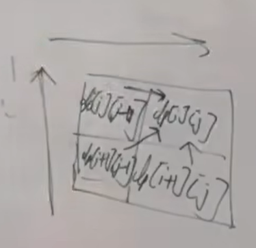

 647. 回文子串，求的是回文子串，而本题要求的是回文子序列， 大家要搞清楚两者之间的区别。 
https://programmercarl.com/0516.%E6%9C%80%E9%95%BF%E5%9B%9E%E6%96%87%E5%AD%90%E5%BA%8F%E5%88%97.html  

力扣：https://leetcode.cn/problems/longest-palindromic-subsequence/description/  


## 思路
### 1.DP数组以及下际的含义
dp[i][j]:[i,j] 的回文子序列的长度为dp[i][j]
### 2.递推公式
```python
if s[i]==s[j]:
    dp[i][j]=dp[i+1][j-1]+2
else:
    dp[i][j]=max(dp[i][j-1],dp[i+1][j])
```

### 3.DP数组如何初始化
`dp[i][i]=1`(i和j相等时，回文长度是1)
```python
for i in range(len(s)):
    dp[i][i]=1
```
### 4.遍历顺序
- 从下往上，从左往右 

```python
for i in range(len(s)-1,-1,-1):
    #i=j时已经初始化过了，所以j从i+1开始
    for j in range(i+1,len(s),1):
```
- 求：`dp[0][len(s)-1]`
### 5.打印DP数组