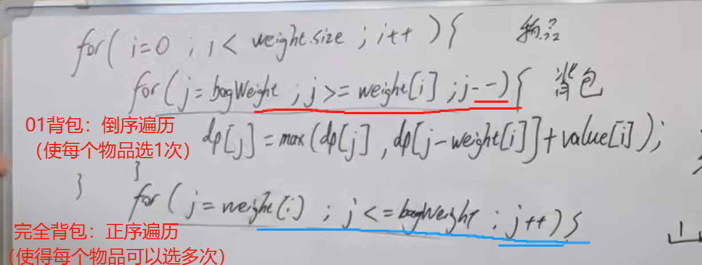

https://programmercarl.com/%E5%8A%A8%E6%80%81%E8%A7%84%E5%88%92%E7%90%86%E8%AE%BA%E5%9F%BA%E7%A1%80.html  


## 很多步骤都需要仔细的想清楚：
这套动态规划类题目才能完整做出来

### 1.DP数组以及下际的含义
### 2.递推公式

### 3.DP数组如何初始化
①自己先推几个初始的dp数组  
②dp[0][0]的**含义**
③根据递推公式

### 4.遍历顺序
### 5.打印DP数组
```python
## 思路
### 1.DP数组以及下际的含义
### 2.递推公式

### 3.DP数组如何初始化


### 4.遍历顺序
### 5.打印DP数组
```


动态规划刷题大纲


## 完全背包
### 1.完全背包的区别
物品可以多次使用
  
### 2.遍历顺序
- 针对一维数组：
  
- 纯完全背包问题：  
>遍历时：
>- 可以先遍历背包，再遍历物品  
>- 也可以先物品在遍历背包


